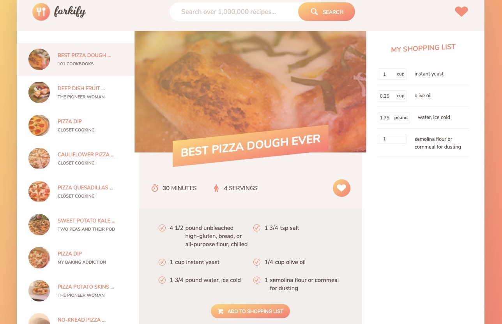

# Forkify

Forkify is a recipe search application used pure JavaScript and webpack. Users are able to enter an ingredient and search for related recipes. Users are also able to add ingredients from one or more recipes to shopping list. Lastly, users are able to 'Like' specific recipes. Based on localstorage, liked recipes would be saved.

Link: http://73.71.152.77:667/



## Getting Started
### Prerequisites

What things you need to install the software:

* [Webpack]


### Installation

First, download and install Node

After you have successfully installed the Webpack library. Download this project and change to the project directory.
```sh
$ cd forkify
```

Install packages that are required for this project.

```sh
$ npm install
```

Start the project

```sh
$ npm start
```

Note: You might interact with errors for missing packages if this is the first time starting this project. Follow the terminal error instruction to install other neccessary packages. 

Node should automatically pop the web browser open with the project running on localhost:8080. If not, simply open your browser and search localhost:8080 to access this project. 
